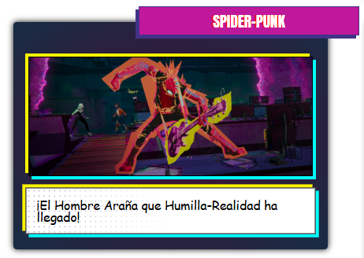

# Librery SpiderMan Miles

Una librería de componentes frontend inspirada en la estética vibrante y urbana de **Miles Morales / Spider-Man**, creada para proyectos modernos con un estilo oscuro, elegante y llamativo.

# Enlace de página de githubpages
https://jairo0610.github.io/Librery-Spiderman-Miles-Morales-/index.html

# Integrantes
Yanira Verenice Martínez Aguilar Ma22013

Fatima Arely Cruz Marquez CM23015

Jairo Alexander Argueta Alvarenga AA23027

Javier Orlando Colocho Bolainez CB23001

## ¿Cómo instalarla?

La instalación de la libreria es algo muy sencillo:

Agrega lo siguiente en el <head> de tu HTML:

`<link rel="stylesheet" href="https://cdn.jsdelivr.net/gh/Jairo0610/Librery-Spiderman-Miles-Morales-@main/Library/Library.css">`

Este es un link opcional para los iconos.
`<link href="https://unpkg.com/boxicons@2.1.4/css/boxicons.min.css" rel="stylesheet">`

Y listo, ya puedes utilizar todos los componentes de la libreria.

## Algunos componentes

### Navbar

### Botones

### Alertas

### Tarjetas

